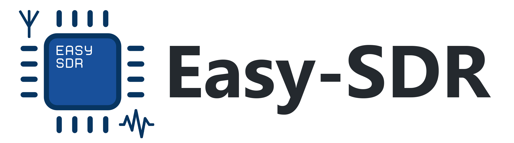

# The project implements some hardware devices for cheap SDR receivers based on Realtek RTL2832U controller 

## What is SDR?
[Software-defined radio (SDR)] is a radio communication system where components that have been traditionally implemented in hardware (e.g. mixers, filters, amplifiers, modulators/demodulators, detectors, etc.) are instead implemented by means of software on a personal computer or embedded system.  

## What are the objectives of this project?
This project is about creation of affordable and easy-to-manufacture prototypes of PCBs which are used to expand the capabilities of existing low-cost SDR receivers based on [RTL2832U](https://www.realtek.com/en/products/communications-network-ics/item/rtl2832u) chip. All the created elements of the project will have a detailed description of the assembly process, with all the existing features and possible problems. If you are only interested in buying ready-made devices, you can contact me on [Telegram](https://t.me/igrikxd).

## Project support
[![BTC: Make a donation][BTC-badge]](https://nowpayments.io/donation/wsprbeacon)&nbsp;[![PayPal: Make a donation][PayPal-badge]](https://www.paypal.com/donate/?hosted_button_id=QUMTQLTAVWNR4)&nbsp;[![Revolut: Make a donation][Revolut-badge]](https://revolut.me/iharygxob)

Your support helps me continue developing open-source projects like [WSPR-beacon](https://github.com/IgrikXD/WSPR-beacon) and [Easy-SDR](https://github.com/IgrikXD/Easy-SDR), while also enabling the creation of new tools that benefit the community.

## Current development progress
 

## Currently available modules at EasyEDA platform
 [Antenna Mini-Whip (TH)]  
 [Antenna Mini-Whip (SMD)]   
 [Coax power supply, fixed voltage (SMD, ENCLOSURE)]  
 [HF Upconverter (SMD, ENCLOSURE)]   
 [LNA, Bias Tee powered (SMD, ENCLOSURE)]  
 [LNA, Bias Tee powered + filtering (SMD, ENCLOSURE)]  
 [PI Attenuator (SMD)]  
 [SPDT Antenna switch (SMD, ENCLOSURE)]   

### Deprecated implementations of modules on the EasyEDA platform (will be reworked or removed)
- [HF Antenna power supply (SMD)]
- [HF Upconverter (TH)]
- [HF Upconverter (SMD)]
- [LNA (SMD)]

## Current available information articles
- [How to export Gerber file from EasyEDA]
- [How to order from JLCPCB]
- [How to order from LCSC]
- [How to order from PCBWay]
- [How to work with RTL-SDR receivers on Linux]

## How to use this repository?
In the root of the repository select a device of interest and go to the appropriate directory (for example [HF Upconverter](./HF%20Upconverter)). After the transition, select the component group of interest ([SMD](./HF%20Upconverter/SMD) or [TH](./Antenna%20Mini-Whip/TH)). Also in [Datasheets](./HF%20Upconverter/SMD/Datasheets) and [Schematics](./HF%20Upconverter/SMD/Schematics) directories, you can find all necessary technical documentation for the used components and schematic files in PDF format. If you only need GERBER files, you can find them in the appropriate [Gerbers](./HF%20Upconverter/SMD/Gerbers) directory for the selected components group. By the next step, you can download project files for the [EasyEDA](./HF%20Upconverter/SMD/EasyEDA) platform, which can later be [loaded into the editor](./HF%20Upconverter/SMD/EasyEDA/README.md) for viewing and editing. Based on submitted files, you can order PCB from factory manufacturing make the device independently.

## Where can I buy an SDR receiver?
You can order the SDR receiver on any of the currently available internet sites, such as eBay, Aliexpress, Taobao, etc. Or you can use the following links to order some advanced versions of SDR receivers:

| Store | Information |
| ----- | ----------- |
| [RTL-SDR.COM] | International delivery. Performed selling modified versions of receivers based on RTL2832U chip. Performs support and develop new versions of hardware solutions. There is a large set of various useful information (software, articles, manuals, news). |
| [NooElec] | International delivery. Large selection of SDR receivers based on RTL2832U chip and accessories, such as HF Upconverters, SAW filters, LNA, attenuators, antennas. |
| [Airspy] | Much more productive and expensive devices compared to devices based on RTL2832U. You can choose a retailer according to your whereabouts. Performs support and develop new versions of software and hardware solutions. There are links for [downloading SDRSharp](https://airspy.com/download/) and software for working with the server part. |

## Who helped me with the development of the project?
Great thanks to [RTL-SDR.COM] for the provided samples of SDR receivers RTL-SDR.COM V.3 and information support. [LCSC] company that provided most of the electronic components used for assembly for completely free. [Mini-Circuits] company for the providing samples of [ADE] frequency mixers, [PSA4-5043+] and [PGA-103+] amplifiers, and Bias Tees [TCBT-14+] by [EZ-Sample] program. And also [PCBWay] for $ 70 discount when ordering PCBs for the project.

## How to contact me?
- E-mail: igor.nikolaevich.96@gmail.com
- Telegram: https://t.me/igrikxd
- LinkedIn: https://www.linkedin.com/in/igor-yatsevich/

You can also [contact me](https://t.me/igrikxd) to purchase ready-made devices.

[Software-defined radio (SDR)]: <https://en.wikipedia.org/wiki/Software-defined_radio>
[RTL-SDR.COM]: <https://www.rtl-sdr.com/buy-rtl-sdr-dvb-t-dongles/>
[NooElec]: <http://www.nooelec.com/store/sdr.html>
[Airspy]: <https://airspy.com/purchase/>
[LCSC]: <https://lcsc.com/>
[Mini-Circuits]: <https://ww2.minicircuits.com/homepage/homepage.html>
[PCBWay]: <https://www.pcbway.com/>
[ADE]: <https://www.minicircuits.com/WebStore/dashboard.html?model=ADE-1%2B>
[PSA4-5043+]: <https://www.minicircuits.com/WebStore/dashboard.html?model=PSA4-5043%2B>
[PGA-103+]: <https://www.minicircuits.com/WebStore/dashboard.html?model=PGA-103%2B>
[TCBT-14+]: <https://www.minicircuits.com/WebStore/dashboard.html?model=TCBT-14%2B>
[EZ-Sample]: <https://www.minicircuits.com/WebStore/ez_sample.html>
[Antenna Mini-Whip (TH)]: <https://easyeda.com/igor.nikolaevich.96/Antenna_Mini_Whip-d8935f151d3a4221a9a3aacae3acdb65>
[Antenna Mini-Whip (SMD)]: <https://easyeda.com/IgrikXD/Antenna_Mini_Whip_SMD-74e9e6740b814f6c901a811855125754>
[Coax power supply, fixed voltage (SMD, ENCLOSURE)]: <https://easyeda.com/IgrikXD/coax-power-supply-smd-enclosure>
[HF Upconverter (SMD, ENCLOSURE)]: <https://easyeda.com/IgrikXD/hf-upconverter-smd-enclosure>
[LNA, Bias Tee powered (SMD, ENCLOSURE)]: <https://easyeda.com/IgrikXD/bias-tee-lna-smd-enclosure>
[LNA, Bias Tee powered + filtering (SMD, ENCLOSURE)]: <https://easyeda.com/IgrikXD/bias-tee-filtering-lna-smd-enclosure>
[SPDT Antenna switch (SMD, ENCLOSURE)]: <https://easyeda.com/IgrikXD/spdt-antenna-switch-smd-enclosure>
[HF Antenna power supply (SMD)]: <https://easyeda.com/IgrikXD/Antenna-power-supply-SMD>
[HF Upconverter (TH)]: <https://easyeda.com/IgrikXD/HF_Upconverter_ADE_series_mixers-b319a09d843a495baa5be52cb93d76d8>
[HF Upconverter (SMD)]: <https://easyeda.com/IgrikXD/HF_Upconverter_SMD-3cfb364d4cd2413abd3e60c4312f322d>
[LNA (SMD)]: <https://easyeda.com/IgrikXD/LNA-SMD>
[PI Attenuator (SMD)]: <https://easyeda.com/IgrikXD/PI-Attenuator-SMD>
[How to export Gerber file from EasyEDA]: <./Useful%20info/How%20to%20export%20Gerber%20file%20from%20EasyEDA.md>
[How to order from JLCPCB]: <./Useful%20info/How%20to%20order%20from%20JLCPCB.md>
[How to order from LCSC]: <./Useful%20info/How%20to%20order%20from%20LCSC.md>
[How to order from PCBWay]: <./Useful%20info/How%20to%20order%20from%20PCBWay.md>
[How to work with RTL-SDR receivers on Linux]: <./Useful%20info/How%20to%20work%20with%20RTL-SDR%20receivers%20on%20Linux.md>

[BTC-badge]: https://img.shields.io/badge/BTC-Make%20a%20donation-orange.svg?logo=data:image/svg+xml;base64,PHN2ZyB2aWV3Qm94PSIwIDAgMjQgMjQiIHhtbG5zPSJodHRwOi8vd3d3LnczLm9yZy8yMDAwL3N2ZyI+PHBhdGggZD0iTTIzLjYzNiAxNC45MDJjLTEuNjAyIDYuNDMtOC4xMTQgMTAuMzQyLTE0LjU0MyA4Ljc0QzIuNjY2IDIyLjAzNy0xLjI0NiAxNS41MjUuMzU3IDkuMDk4IDEuOTYgMi42NjkgOC40Ny0xLjI0NCAxNC44OTcuMzU5YzYuNDMgMS42MDIgMTAuMzQxIDguMTE1IDguNzM5IDE0LjU0NCIgZmlsbD0iI2Y3OTMxYSIvPjxwYXRoIGQ9Ik0xNC42ODYgMTAuMjY3Yy0uMzcxIDEuNDg3LTIuNjYzLjczMS0zLjQwNi41NDZsLjY1NS0yLjYyOWMuNzQzLjE4NiAzLjEzOC41MzEgMi43NSAyLjA4M20tLjQwNiA0LjI0MmMtLjQwNyAxLjYzNS0zLjE2Ljc1LTQuMDUzLjUzbC43MjQtMi45Yy44OTMuMjI0IDMuNzU0LjY2NCAzLjMzIDIuMzdtMy4wMDgtNC4yMTljLjIzOC0xLjU5Ni0uOTc3LTIuNDU1LTIuNjQtMy4wMjdsLjU0LTIuMTYzLTEuMzE4LS4zMy0uNTI1IDIuMTA3YTU0LjI5MiA1NC4yOTIgMCAwIDAtMS4wNTQtLjI0OWwuNTMtMi4xMi0xLjMxNy0uMzI4LS41NCAyLjE2MmMtLjI4Ni0uMDY1LS41NjctLjEzLS44NC0uMTk4bC4wMDEtLjAwNy0xLjgxNi0uNDUzLS4zNSAxLjQwNnMuOTc3LjIyNC45NTYuMjM4Yy41MzMuMTMzLjYzLjQ4Ni42MTMuNzY2bC0uNjE1IDIuNDYzYy4wMzguMDEuMDg1LjAyNC4xMzcuMDQ1bC0uMTM4LS4wMzUtLjg2MiAzLjQ1MmMtLjA2NS4xNjEtLjIzLjQwNS0uNjA0LjMxMi4wMTQuMDItLjk1Ny0uMjM5LS45NTctLjIzOUw1LjgzNiAxNS42bDEuNzE0LjQyN2MuMzE4LjA4LjYzLjE2NC45MzguMjQybC0uNTQ1IDIuMTkgMS4zMTUuMzI4LjU0LTIuMTY0Yy4zNi4wOTcuNzA4LjE4NyAxLjA1LjI3MWwtLjUzOCAyLjE1NiAxLjMxNi4zMjguNTQ2LTIuMTgzYzIuMjQ1LjQyNCAzLjkzMy4yNTMgNC42NDMtMS43NzcuNTc0LTEuNjM1LS4wMjctMi41NzgtMS4yMDgtMy4xOTQuODYtLjE5OCAxLjUwOC0uNzY1IDEuNjgxLTEuOTM0IiBmaWxsPSIjZmZmIi8+PC9zdmc+&style=for-the-badge
[PayPal-badge]: https://img.shields.io/badge/PayPal-Make%20a%20donation-blue.svg?logo=data:image/svg+xml;base64,PHN2ZyB2aWV3Qm94PSIwIDAgMjQgMjQiIHhtbG5zPSJodHRwOi8vd3d3LnczLm9yZy8yMDAwL3N2ZyI+PHBhdGggZD0iTTE5LjcxNSA2LjEzM2MuMjQ5LTEuODY2IDAtMy4xMS0uOTk5LTQuMjY2QzE3LjYzNC42MjIgMTUuNzIxIDAgMTMuMzA3IDBINi4yMzVjLS40MTggMC0uOTE2LjQ0NC0xIC44ODlMMi4zMjMgMjAuNjIyYzAgLjM1Ni4yNS44LjY2NS44aDQuMzI4bC0uMjUgMS45NTZjLS4wODQuMzU1LjE2Ni42MjIuNDk4LjYyMmgzLjY2M2MuNDE3IDAgLjgzMi0uMjY3LjkxNS0uNzExdi0uMjY3bC43NDktNC42MjJ2LS4xNzhjLjA4My0uNDQ0LjUtLjguOTE1LS44aC41YzMuNTc4IDAgNi4zMjUtMS41MSA3LjE1Ni01Ljk1NS40MTgtMS44NjcuMjUyLTMuMzc4LS43NDctNC40NDUtLjI1LS4zNTUtLjY2Ni0uNjIyLTEtLjg4OSIgZmlsbD0iIzAwOWNkZSIvPjxwYXRoIGQ9Ik0xOS43MTUgNi4xMzNjLjI0OS0xLjg2NiAwLTMuMTEtLjk5OS00LjI2NkMxNy42MzQuNjIyIDE1LjcyMSAwIDEzLjMwNyAwSDYuMjM1Yy0uNDE4IDAtLjkxNi40NDQtMSAuODg5TDIuMzIzIDIwLjYyMmMwIC4zNTYuMjUuOC42NjUuOGg0LjMyOGwxLjE2NC03LjM3OC0uMDgzLjI2N2MuMDg0LS41MzMuNS0uODg5Ljk5OC0uODg5aDIuMDhjNC4wNzkgMCA3LjI0MS0xLjc3OCA4LjI0LTYuNzU1LS4wODMtLjI2NyAwLS4zNTYgMC0uNTM0IiBmaWxsPSIjMDEyMTY5Ii8+PHBhdGggZD0iTTkuNTYzIDYuMTMzYy4wODItLjI2Ni4yNS0uNTMzLjQ5OC0uNzEuMTY2IDAgLjI1LS4wOS40MTYtLjA5aDUuNDk0Yy42NjYgMCAxLjMzLjA5IDEuODMuMTc4LjE2NiAwIC4zMzMgMCAuNDk4LjA4OS4xNjguMDg5LjMzNC4wODkuNDE4LjE3OGguMjVjLjI0OC4wODkuNDk3LjI2Ni43NDguMzU1LjI0OC0xLjg2NiAwLTMuMTEtLjk5OS00LjM1NUMxNy43MTcuNTMzIDE1LjgwNCAwIDEzLjM5IDBINi4yMzVjLS40MTggMC0uOTE2LjM1Ni0xIC44ODlMMi4zMjMgMjAuNjIyYzAgLjM1Ni4yNS44LjY2NS44aDQuMzI4bDEuMTY0LTcuMzc4IDEuMDg0LTcuOTF6IiBmaWxsPSIjMDAzMDg3Ii8+PC9zdmc+&style=for-the-badge
[Revolut-badge]: https://img.shields.io/badge/Revolut-Make%20a%20donation-black.svg?logo=data:image/svg+xml;base64,PHN2ZyByb2xlPSJpbWciIHZpZXdCb3g9IjAgMCAyNCAyNCIgeG1sbnM9Imh0dHA6Ly93d3cudzMub3JnLzIwMDAvc3ZnIj48dGl0bGU+UmV2b2x1dDwvdGl0bGU+PHBhdGggZD0iTTIwLjkxMzMgNi45NTY2QzIwLjkxMzMgMy4xMjA4IDE3Ljc4OTggMCAxMy45NTAzIDBIMi40MjR2My44NjA1aDEwLjk3ODJjMS43Mzc2IDAgMy4xNzcgMS4zNjUxIDMuMjA4NyAzLjA0My4wMTYuODQtLjI5OTQgMS42MzMtLjg4NzggMi4yMzI0LS41ODg2LjU5OTgtMS4zNzUuOTMwMy0yLjIxNDQuOTMwM0g5LjIzMjJhLjI3NTYuMjc1NiAwIDAgMC0uMjc1NS4yNzUydjMuNDMxYzAgLjA1ODUuMDE4LjExNDIuMDUyLjE2MTJMMTYuMjY0NiAyNGg1LjMxMTRsLTcuMjcyNy0xMC4wOTRjMy42NjI1LS4xODM4IDYuNjEtMy4yNjEyIDYuNjEtNi45NDk0ek02Ljg5NDMgNS45MjI5SDIuNDI0VjI0aDQuNDcwNHoiLz48L3N2Zz4=&style=for-the-badge
